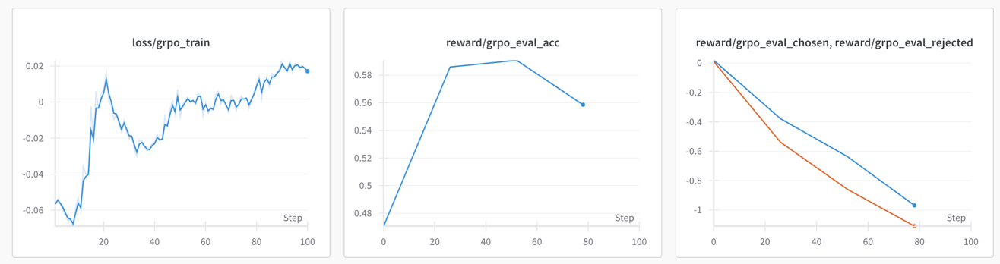

# DPO and GRPO
My replication of two RLHF algorithms:
* DPO [Direct Preference Optimization: Your Language Model is Secretly a Reward Model](https://arxiv.org/abs/2305.18290) In my view, very similar to how an offline RL algorithm like [AWAC](https://arxiv.org/abs/2006.09359) to learn a policy. 
* GRPO (Group Relative Policy Optimization), introduced in [DeepSeekMath: Pushing the Limits of Mathematical Reasoning in Open Language Models](https://arxiv.org/abs/2402.03300), and is a variant of PPO ([Proximal Policy Optimization](https://arxiv.org/abs/1707.06347)).

See [my notes on the papers](https://github.com/wuwowuyi/LLMs-paper-notes).

The implementation tries to be simple, clean and easy to read, from scratch using Pytorch, trained with FSDP.

## Summary

Summary first.

DPO is easy to implement, and very resource efficient to train.

Compared with DPO, the reward model has better performance in terms of scoring a response. And **reward modeling is critical** for training the policy model. In my experiments, the GRPO policy can get an evaluation accuracy close to the reward model but not stable, perhaps because the rewarding scores are very noisy.

Even though GRPO does not train a value function model $V(s)$, it is still very resource intensive especially when there is only one policy update for each batch (DeepSeek default setting). Without a value function we need a much larger batch size to reduce variance, which greatly increase the rollouts generation and gradient computation time.

:thinking Maybe combing DPO and a reward model is a viable in some cases? like we can generate samples from the DPO policy, label them by the reward model to generate pairs and then train DPO policy? Reasons:
* reward model is better in scoring a sample
* no distributional shift since samples are from the policy itself
* resource efficient

We should also perform the training iteratively to avoid distributional shift.

### Training notes
#### FSDP

FSDP spares me a lot of pain in dealing with the OOM (OutOfMemory) errors. However, it is not that straightforward to use, especially compared with DDP. 

##### Wrapping
FSDP unit wrapping is central in using FSDP. 

PyTorch offers several auto-wrap policies, such as transformer_auto_wrap_policy for wrapping transformers. However, if we customize the transformer, such as using it as a submodule, this wrapping policy will not work.

```python
class Policy(nn.Module):
    
    def __init__(self):
        super().__init__()
        self.lm_model = <Some transformer like GPT2>
        ...
    
    def forward(self, input, *args, **kwargs):
        ....
```
The `transformer_auto_wrap_policy` won't work with the `Policy` model defined above.
I guess in this case we need to define a custom wrapping policy.

##### Mixed precision and model parameter precision

We know the optimization states take most of the GPU memory, especially for algorithms like Adam, which keeps a copy of parameter, and first and second moments. FSDP `MixedPrecision` allows to use different data types for different operations like forward, backward, all-reduce, etc., which can save a lot of memory and is very convenient to use. 

Note `MixedPrecision` settings do not affect the precision of sharded parameters which can still be kept in full precision float32. And I found loading a model in bfloat16 slightly hurts training performance.

##### Set `use_orig_params=True` to access original parameters

Model parameters are stored in gigantic flattened 1D tensors by FSDP. 
If we want to use something like `named_parameters()`, by setting `use_orig_params=True` FSDP exposes a view of the original parameter structure into the flattened parameters.

##### No distributed operations inside `if rank == 0`
The following code freezes training.
```python
if rank == 0:
    distributed.all_reduce(loss, op=distributed.ReduceOp.AVG)
```
For `all_reduce`, `all_gather` or other distributed operations, all ranks must call this operation, not just the master process.

#### Reduce memory footprint
I spent a lot of time fixing OOM errors.

In addition to gradient accumulation and FSDP activation checkpointing:
* use FSDP `CPUOffload(offload_params=True)` can save memory by offloading a model to CPU when it is not used.
* We usually keep a list of losses or metrics during gradient accumulation, remember to call `detach()` so that the tensors are detached from computing graph, otherwise garbage collector won't release the memory!

#### GPT2
##### GPT2 position_ids
GPT-2 learns **absolute positional embeddings**. It is critical to feed in `position_ids` to model. In my tests, the reward model didn't train until `position_ids` is provided.
However, when using transformer's `generate` method, providing `position_ids` fails text generation completely.

##### Padding side
Pad prompt on the left, and response on the right, if we want to concatenate them. There should be no padding tokens in the middle otherwise it won't work.
For the reward model, since the score is computed on the entire prompt + response, moving all the padding tokens to the left can increase performance, related to GPT2's absolute positional embeddings.

## Setup

Training generally follows OpenAI's RLHF methods, using Pytorch FSDP.

### Training datasets
For SFT training, [tldr completion](https://huggingface.co/datasets/trl-lib/tldr) dataset is used. Or alternatively, [openai_summarize_tldr](https://huggingface.co/datasets/CarperAI/openai_summarize_tldr) is probably equivalent.

For DPO or the reward model, [tldr preference](https://huggingface.co/datasets/trl-lib/tldr-preference) is used.

For GRPO policy training, prompt (without completion) is sampled from tldr completion dataset.

Evaluation is performed on preference pairs sampled from tldr preference validation split.

### Training pipeline

The pretrained base model is loaded from Hugging face.

#### DPO
DPO model training is shown as below.


Note I didn't do SFT on tldr preference as the [DPO paper implementation](https://github.com/eric-mitchell/direct-preference-optimization) does, since it increases the probability of chosen completions, which feels like a data leakage.

#### GRPO
GRPO training pipeline is depicted below.


SFT is the same as DPO. And a reward model is trained on Tldr preference dataset.

GRPO is a variant of PPO. In my view, it primarily makes two changes:
* uses a sample group mean to approximate baseline to obviate the need for a value function model. 
* changes how per-token KL penalty is computed. 

In addition to these two changes, I found the follow tricks can help improve performance:
* **high temperature rejection sampling**: In the GRPO paper, the batch size is 1024, and each prompt has 64 responses, which means 1024 * 64 samples in one single batch, which takes too long to process on my machine. What I did is that, after generating a group of responses to a prompt, [statistical rejection sampling](https://arxiv.org/abs/2309.06657) is used in order to reduce the total sample size. I only use a batch size of 256, and then rejection sample 8 out of 64 generated responses, which means 256 * 8 samples in one batch. A higher temperature > 1 (beta in the paper), like 2, works well. I see this value trades off exploitation and exploration. 
* **ignore loss on tokens after the truncate token**: PPO computes the reward on a post-processed response where all tokens after the truncate token are masked out. However, it still computes the policy loss on the unprocessed responses. Here I compute loss on the post-processed responses because it does not make sense to consider the loss on tokens after the truncate token, especially given how the reward score is calculated.
* **global normalization**. In addition to group normalization, normalizing advantages across all samples in a batch is beneficial.

### Environment
* For simplicity, the implementation only runs on GPUs that support bfloat16, i.e., Ampere or newer. Alternatively, for older GPUs we can use torch.amp package (mixed precision) + gradient scaling, which would use more GPU memory though.
* For simplicity, when FSDP is enabled `torchrun` is used to launch training, this requires CPU big enough to fit the entire model since only later FSDP will shard the model on multiple GPUs. Alternatively, for very large models, we can also use Hugging Face's `device_map` to load models onto GPUs and CPU, and then use `torch.multiprocessing.spawn()` to launch training. See [Loading big models into memory](https://huggingface.co/docs/accelerate/en/concept_guides/big_model_inference#the-devicemap)
* Python 3.9+ 

Tested on pretrained GPT-2 models, to fit my machine which has two Rtx 3090.

| model      | #params | n_layer | n_head | n_embd | context window size |
|------------|---------|---------|--------|--------|---------------------|
| gpt2 small | 124M    | 12      | 12     | 768    | 1024                |
| gpt2 large | 774M    | 36      | 20     | 1280   | 1024                |

## Training

Max prompt length 384, and max response length 56. Increase prompt length to 512 can slightly increase evaluation accuracy by 1-2% on GPT2 small and large.

### DPO

Hyperparameter generally follows the DPO paper.


From the plot above, we can see training nicely increases the reward gap between chosen and rejected completions.

See the [DPO(gpt2-large) wandb training logs](https://wandb.ai/dalucheng/dpo_grpo_rs/runs/plg8pvkw?nw=nwuserdalucheng) here. 

### GRPO


Similar to DPO, as training goes, we can see the gap increases between chosen completion reward and rejected completion reward.

See [the Reward model(gpt2-large) wandb training logs](https://wandb.ai/dalucheng/dpo_grpo_rs/runs/1ti4b6th) here.



In the plot above, we can see the evaluation accuracy increases rapidly, but then goes down. I suspect it is because the reward model is noisy, and variance is still too big.

### Evaluation result

Evaluation is done by sampling preference pairs from [tldr preference](https://huggingface.co/datasets/trl-lib/tldr-preference) validation split, and comparing the rewards of chosen $r_w$ and rejected $r_l$ completions.

For DPO and GRPO, $\displaystyle r = \beta\log\frac{\pi_\theta(y|x)}{\pi_{ref}(y|x)}$. <br>
For reward, $r$ is simply the output reward value.

| Evaluation accuracy | DPO  | Reward model | GRPO policy |
|---------------------|------|--------------|-------------|
| gpt2 small (124M)   | 0.61 | 0.62         | 0.59        |
| gpt2 large (774M)   | 0.62 | 0.66         | n/a         |

The GRPO policy is guided by a reward model of the same size. Ideally we can use a larger reward model to guide policy, but in my environment it takes too long to train.


