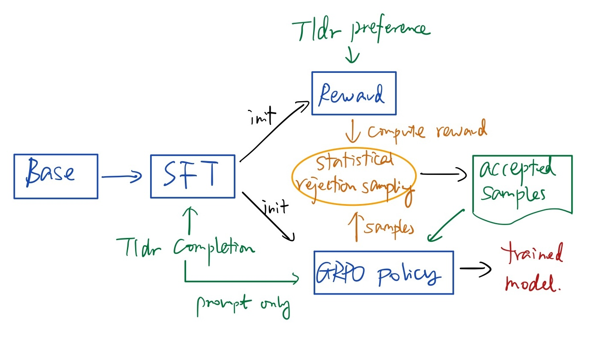
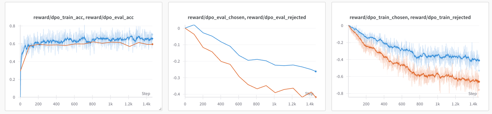
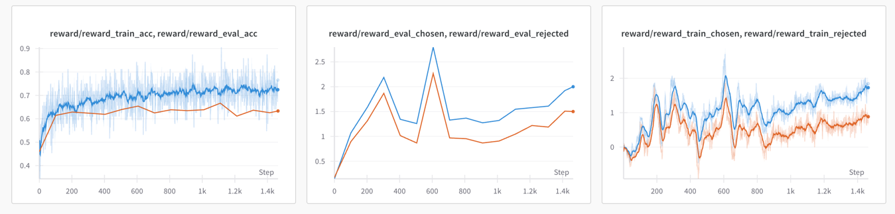

# DPO and GRPO
My replication of two RLHF algorithms:
* DPO [Direct Preference Optimization: Your Language Model is Secretly a Reward Model](https://arxiv.org/abs/2305.18290) 
* GRPO, introduced in [DeepSeekMath: Pushing the Limits of Mathematical Reasoning in Open Language Models](https://arxiv.org/abs/2402.03300), and is a variant of [PPO (Proximal Policy Optimization)](https://arxiv.org/abs/1707.06347).

See [my notes on the papers](https://github.com/wuwowuyi/LLMs-paper-notes).

The implementation tries to be simple, clean and easy to read, from scratch using Pytorch.

## Setup

Training generally follows OpenAI's RLHF papers, using Pytorch FSDP.

### Training datasets
For SFT training, [tldr completion](https://huggingface.co/datasets/trl-lib/tldr) dataset is used. Or alternatively, [openai_summarize_tldr](https://huggingface.co/datasets/CarperAI/openai_summarize_tldr) is probably equivalent.

For DPO or the reward model, [tldr preference](https://huggingface.co/datasets/trl-lib/tldr-preference) is used.

For GRPO training, prompt (without completion) is sampled from tldr completion dataset.

Evaluation is performed on preference pairs sampled from tldr preference validation split.

### Training pipeline

The pretrained base model is loaded from Hugging face.

#### DPO
DPO model training is shown as below.

Note I didn't do SFT on tldr preference as the [DPO paper implementation](https://github.com/eric-mitchell/direct-preference-optimization) does, since it increases the probability of chosen completions, which feels like data leakage.

#### GRPO
GRPO training pipeline is depicted below.

SFT is the same as DPO. And a reward model is trained on Tldr preference dataset.

The training pipeline generally follows OpenAI's RLHF papers, except that
* After generating a group of responses to a prompt, [statistical rejection sampling](https://arxiv.org/abs/2309.06657) is used in order to reduce the total sample size. In the GRPO paper, the batch size is 1024, and each prompt has 64 responses, which is 1024 * 64 samples in one single batch, which takes too long to process on my machine. Instead, I only use a batch size 256, and rejection sampling 8 out of 64 generated responses, which means 256 * 8 samples in one batch.
* one single policy update as described in the GRPO paper, instead of multiples as PPO does
* PPO computes reward on a post-processed response which has all tokens masked out after the truncate token. But it still computes loss on the unprocessed responses. Here I compute loss on the post-processed responses because it does not make sense to me to care the loss on tokens after the truncate token.

### Environment
* For simplicity, the implementation only runs on GPUs that support bfloat16, i.e., Ampere or newer. Alternatively, for older GPUs we can use torch.amp package (mixed precision) + gradient scaling, which would use more GPU memory though.
* For simplicity, when FSDP is enabled `torchrun` is used to launch training, this requires CPU big enough to fit the entire model since only later FSDP will shard the model on multiple GPUs. Alternatively, for very large models, we can also use Hugging Face's `device_map` to load models onto GPUs and CPU, and then use `torch.multiprocessing.spawn()` to launch training. See [Loading big models into memory](https://huggingface.co/docs/accelerate/en/concept_guides/big_model_inference#the-devicemap)
* Python 3.9+ 

Tested on pretrained GPT-2 models, to fit my machine which has two Rtx 3090.

| model      | #params | n_layer | n_head | n_embd | context window size |
|------------|---------|---------|--------|--------|---------------------|
| gpt2 small | 124M    | 12      | 12     | 768    | 1024                |
| gpt2 large | 774M    | 36      | 20     | 1280   | 1024                |

## Training

Max prompt length 384, and max response length 56. Increase prompt length to 512 can slightly increase evaluation accuracy by 1-2% on GPT2 small and large.

### DPO

Hyperparameter generally follows the DPO paper:
* learning rate 5e-7, cosine annealing to 1e-7. But learning grate is not very sensitive. 1e-6 can get similar performance. 
* beta 0.1
* label smoothing 0.0.
* batch size 64.
* trained on tldr preference for 1 epoch

From the plot above, we can see training nicely increases the reward gap between chosen and rejected completions.

See the [DPO(gpt2-large) wandb training logs](https://wandb.ai/dalucheng/dpo_grpo_rs/runs/plg8pvkw?nw=nwuserdalucheng) here. 

### GRPO
#### Reward model

See [the Reward model(gpt2-large) wandb training logs](https://wandb.ai/dalucheng/dpo_grpo_rs/runs/1ti4b6th) here.

### Evaluation result

Evaluation is done by sampling preference pairs from [tldr preference](https://huggingface.co/datasets/trl-lib/tldr-preference) validation split, and comparing the rewards of chosen $r_w$ and rejected $r_l$ completions.

For DPO and GRPO, $\displaystyle r = \beta\log\frac{\pi_\theta(y|x)}{\pi_{ref}(y|x)}$.  
For reward, $r$ is simply the output reward value.

| Evaluation accuracy | DPO  | Reward model | GRPO policy |
|---------------------|------|--------------|-------------|
| gpt2 small          | 0.61 | 0.62         | 0.58        |
| gpt2 large          | 0.62 | 0.66         | n/a         |

The GRPO policy is guided by a reward model of the same size. 

We can see **reward modeling is critical** for GRPO policy model.

